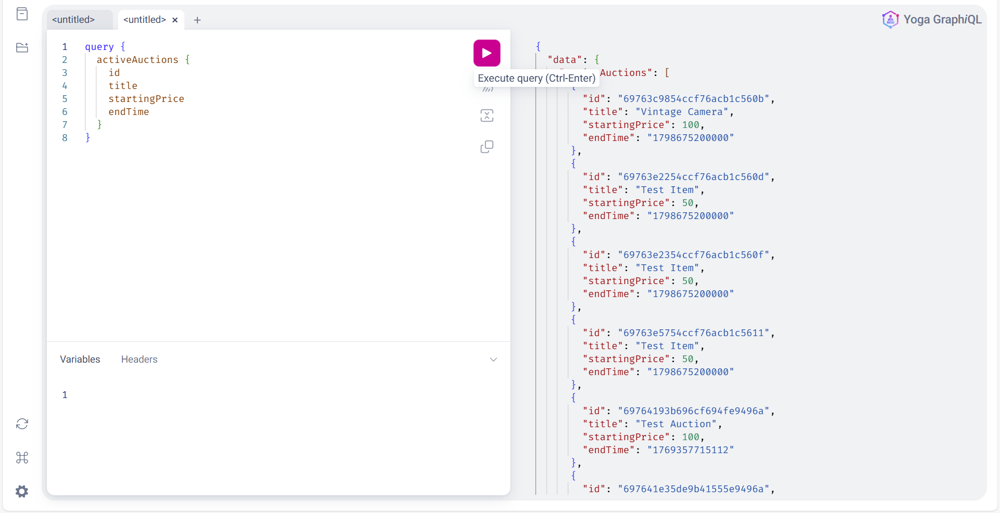
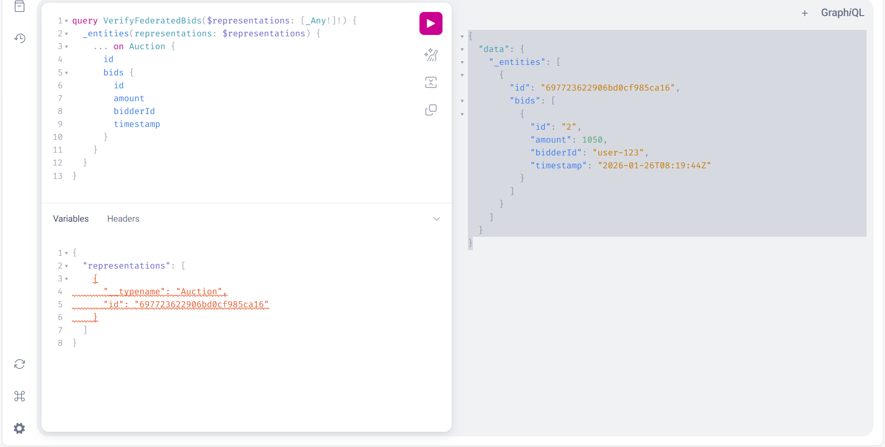
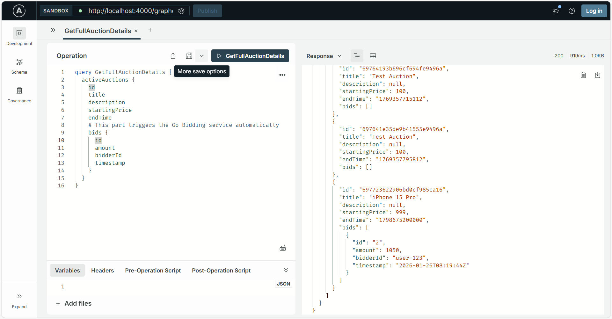

📍 Service Endpoints
Service	Technology	Port	URL

| Service                | Technology                       | Port | URL                                                            |
| ---------------------- | -------------------------------- | ---- | -------------------------------------------------------------- |
| **Apollo Gateway**     | Node.js + Apollo Federation      | 4000 | [http://localhost:4000/graphql](http://localhost:4000/graphql) |
| **Inventory Subgraph** | Node.js + GraphQL Yoga + MongoDB | 5002 | [http://localhost:5002/graphql](http://localhost:5002/graphql) |
| **Bidding Subgraph**   | Go + gqlgen + PostgreSQL         | 8080 | [http://localhost:8080/query](http://localhost:8080/query)     |

### 🔍 1. Inventory Service (Port 5002)

Handles the Product / Auction metadata side of the system.
Data is stored in MongoDB.

➕ Create a New Auction
mutation CreateAuction {
  createAuction(
    title: "Vintage Camera"
    startingPrice: 150.00
    endTime: "2026-12-31T23:59:59Z"
  ) {
    id
    title
  }
}

📦 Get All Active Auctions
query GetItems {
  activeAuctions {
    id
    title
    startingPrice
  }
}

### 🔍 2. Bidding Service (Port 8080)

Handles the Transactional / Bidding logic.
Data is stored in PostgreSQL.

⚠️ This service extends the Auction entity from the Inventory service using Apollo Federation.

💰 Place a New Bid
mutation PlaceNewBid {
  placeBid(
    auctionId: "PASTE_MONGODB_ID_HERE"
    amount: 175.50
  ) {
    id
    amount
    timestamp
  }
}

🔗 Internal Federation Query (_entities)

Used internally by the Apollo Gateway to join Inventory + Bidding data.

query GetBidsForEntity($rep: [_Any!]!) {
  _entities(representations: $rep) {
    ... on Auction {
      id
      bids {
        amount
        timestamp
      }
    }
  }
}

Variables

{
  "rep": [
    {
      "__typename": "Auction",
      "id": "ID_HERE"
    }
  ]
}

### 🔍 3. Unified Gateway Queries (Port 4000)

This is the main interview showcase 🎯
Demonstrates a real federated JOIN between MongoDB (Inventory) and PostgreSQL (Bidding).

🏆 Full System View (“Money Query”)
query GetAllDetails {
  activeAuctions {
    id
    title
    description
    startingPrice

    # JOIN: Data fetched from Go (Bidding) service
    bids {
      id
      amount
      bidderId
      timestamp
    }
  }
}
